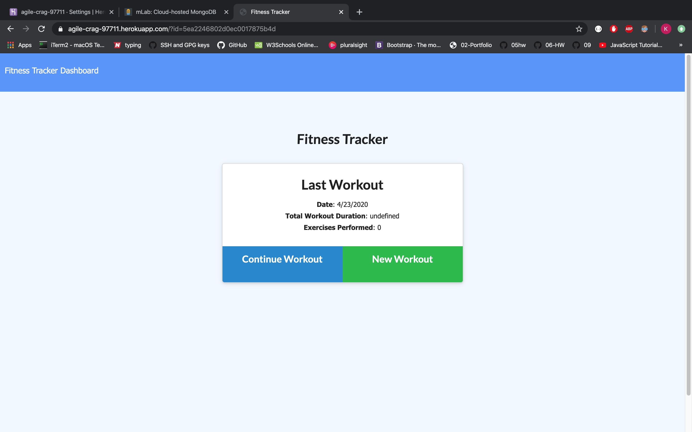
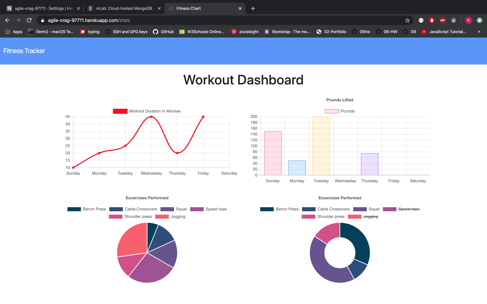

# Unit 17 Nosql Homework: Workout Tracker
A workout tracker made with HTML, CSS, Javascript, MongoDb, Node.js and express and mongoose node packages. This app allows you to track your workouts by date, creating a workout through a post route. It allows for categories, either cardio or resistance and logs the stats from these workouts in a database. The user is then then presented with the latest workout on the home page, through a get route, and can either update the workout or mark it complete through a post route. It also presents the stats for the week by going to the stats page through a get route.

## [CLICK HERE TO GET SWOLE](https://agile-crag-97711.herokuapp.com/)

